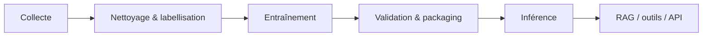
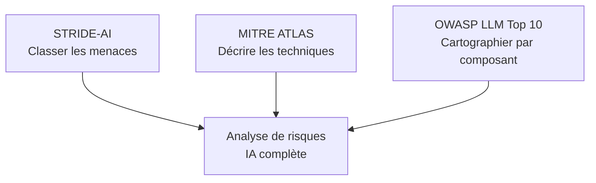

L'IA transforme profondément les architectures logicielles — et avec elle, la surface d'attaque. Les frameworks de threat modeling classiques comme STRIDE restent pertinents, mais ils ne suffisent plus seuls face aux menaces spécifiques aux systèmes d'IA. Voici pourquoi, et comment y remédier.

---

## Ce qui change avec l'IA

Dans une architecture traditionnelle, les composants à protéger sont bien identifiés : frontend, backend, API, base de données, authentification, dépendances. Les menaces sont relativement bornées.

Avec l'IA, le périmètre s'élargit considérablement. Un attaquant peut désormais :

- empoisonner les **données d'entraînement** pour corrompre le comportement du modèle ;
- injecter de faux documents dans une **base RAG** pour manipuler les réponses ;
- forger des prompts pour **contourner les garde-fous** du modèle ;
- interroger massivement une API pour **reconstruire un modèle** sans y accéder directement ;
- exploiter les **outils connectés** au LLM pour effectuer des actions non autorisées ;
- envoyer des requêtes coûteuses pour **faire exploser la facture cloud**.

Ce qui rend ces attaques particulièrement dangereuses, c'est leur latence.

> Une donnée empoisonnée peut rester invisible pendant des semaines — jusqu'à ce que le modèle soit entraîné, validé, puis déployé en production.
{: .prompt-warning }

> Contrairement à une bibliothèque compromise qu'on peut remplacer en quelques minutes, un modèle empoisonné peut nécessiter un réentraînement complet.
{: .prompt-danger }

---

## La chaîne d'approvisionnement des données

Les systèmes d'IA héritent des risques classiques de la supply chain logicielle — mais ils ajoutent une deuxième chaîne : **la chaîne d'approvisionnement des données**.

Chaque étape est un point d'entrée potentiel pour un attaquant.

| Étape | Risque principal |
|-------|-----------------|
| **Collecte** | Injection de données malveillantes via une source compromise (scraping, tiers) |
| **Labellisation** | Labels corrompus qui enseignent au modèle un mauvais comportement |
| **Entraînement** | Données empoisonnées intégrées dans les poids du modèle |
| **Packaging** | Remplacement du modèle par une version backdoorée dans le registre |
| **Inférence** | Prompt injection, exploitation des outils, fuite d'information |

---

## STRIDE : origine, principe, et limites face à l'IA

### Qu'est-ce que STRIDE ?

[STRIDE](https://learn.microsoft.com/en-us/azure/security/develop/threat-modeling-tool-threats) est un framework de **modélisation des menaces** (*threat modeling*) créé chez **Microsoft en 1999** par **Loren Kohnfelder** et **Praerit Garg**. Il a été popularisé à grande échelle par **Adam Shostack** dans son ouvrage de référence *Threat Modeling: Designing for Security* (2014), et est aujourd'hui intégré au **Microsoft Security Development Lifecycle (SDL)**.

L'idée est simple : pour chaque composant d'un système, on se pose une série de questions structurées autour de six catégories de menaces. Le résultat est une carte des risques que l'on peut ensuite prioriser et mitiger.

> STRIDE est conçu pour fonctionner sur des **diagrammes de flux de données (DFD)**. On identifie chaque composant, chaque flux, chaque point de stockage, et on applique la grille de menaces sur chacun.
{: .prompt-info }

### Les six catégories

| Lettre | Menace | Propriété violée | Question à se poser |
|--------|--------|-----------------|---------------------|
| **S** | Spoofing | Authenticité | Quelqu'un peut-il usurper l'identité d'un composant ou d'un utilisateur ? |
| **T** | Tampering | Intégrité | Des données peuvent-elles être modifiées sans autorisation ? |
| **R** | Repudiation | Non-répudiation | Une action malveillante peut-elle être niée faute de traces ? |
| **I** | Information Disclosure | Confidentialité | Des informations sensibles peuvent-elles être exposées ? |
| **D** | Denial of Service | Disponibilité | Le service peut-il être rendu indisponible ? |
| **E** | Elevation of Privilege | Autorisation | Un utilisateur peut-il obtenir plus de droits que prévu ? |

### Pourquoi ça marche bien pour les applications classiques

Pour une application web traditionnelle, STRIDE couvre l'essentiel :

- **S** → un utilisateur peut-il se faire passer pour un autre ? (session hijacking, CSRF)
- **T** → des données en transit peuvent-elles être altérées ? (man-in-the-middle)
- **R** → les actions des admins sont-elles auditées ?
- **I** → une API expose-t-elle des données non filtrées ?
- **D** → un endpoint est-il protégé contre les requêtes en masse ?
- **E** → une IDOR permet-elle d'accéder aux ressources d'un autre utilisateur ?

C'est précis, actionnable, et bien outillé (Microsoft Threat Modeling Tool, OWASP Threat Dragon, etc.).

Cette grille reste très utile. Le problème est que, appliquée telle quelle à l'IA, elle manque plusieurs angles critiques.

### Le Tampering prend une nouvelle dimension

Dans STRIDE, le Tampering désigne la modification non autorisée de données. Ça fonctionne bien pour une base de données ou un fichier de config.

Mais dans l'IA, **le data poisoning** est radicalement différent :

- les effets sont **retardés** — le modèle est entraîné, validé, puis déployé avant que la compromission soit visible ;
- l'impact est **diffus** — le modèle ne crashe pas, il se comporte juste mal dans certains cas précis ;
- la correction est **coûteuse** — il faut identifier les données corrompues, les retirer, et réentraîner.

### Les attaques adversariales sont hybrides

Un attaquant peut créer des entrées spécialement conçues pour faire échouer le modèle — mauvaise classification, hallucination contrôlée, contournement de filtre. Ce type d'attaque peut relever simultanément du Tampering, du Spoofing et de l'Elevation of Privilege. STRIDE n'a pas été conçu pour des menaces aussi hybrides.

### La notion de privilège change avec les LLM

Dans une application classique, une élévation de privilèges signifie : un utilisateur obtient des droits administrateur. Dans un système LLM, un jailbreak peut transformer le chatbot en **interface d'attaque** — sans jamais toucher au système de permissions.

L'attaquant n'obtient pas un accès root. Il obtient indirectement les capacités du modèle et de tous ses outils connectés.

### La fuite d'information peut cibler le modèle lui-même

Dans l'IA, l'actif volé peut être le modèle lui-même. Un attaquant peut interroger une API de manière répétée pour reconstruire une copie fonctionnelle du modèle — c'est le **model extraction** ou **model stealing**.

---

## Réadapter STRIDE au contexte IA

STRIDE n'est pas à abandonner. Il faut le **réinterpréter** pour chaque catégorie.

| STRIDE | Manifestation en IA | Exemple concret |
|--------|---------------------|-----------------|
| **Spoofing** | Usurpation de source de données | Injection de faux documents dans une base RAG |
| **Tampering** | Data poisoning | Données d'entraînement manipulées pour biaiser le modèle |
| **Repudiation** | Absence de traçabilité | Impossible d'expliquer une décision du modèle a posteriori |
| **Information Disclosure** | Model extraction | Reconstruction du modèle via son API publique |
| **Denial of Service** | Denial of wallet | Requêtes coûteuses qui font exploser la facture d'inférence |
| **Elevation of Privilege** | Jailbreak / guardrail bypass | Contournement des règles du LLM via prompt injection |

> STRIDE adapté à l'IA (STRIDE-AI) donne une première carte des menaces. Mais pour aller plus loin, il faut le compléter.
{: .prompt-tip }

---

## Cas pratique : DIMAM3AK

Pour rendre ça concret, prenons **DIMAM3AK** — une entreprise fictive spécialisée dans la fintech qui opère :

- un chatbot client basé sur un LLM ;
- un pipeline RAG connecté à une base documentaire interne ;
- un système de détection de fraude réentraîné chaque mois ;
- un moteur de recommandation accessible via API ;
- des outils connectés au chatbot pour consulter des données clients.

Appliquons STRIDE-AI :

**S — Spoofing :** un attaquant injecte de faux documents dans la base RAG. Le chatbot répond avec des informations fausses, mais avec la confiance d'une source interne.

**T — Tampering :** des transactions malveillantes sont injectées dans les données d'entraînement du modèle de fraude. Le modèle apprend progressivement à ignorer certains schémas frauduleux.

**R — Repudiation :** DIMAM3AK ne journalise ni les versions de modèles, ni les entrées, ni les sorties, ni le contexte RAG utilisé. Impossible d'expliquer ou d'auditer une décision problématique après coup — ce qui pose un problème réglementaire en plus du risque de sécurité.

**I — Information Disclosure :** un concurrent interroge massivement l'API du moteur de recommandation et reconstruit un modèle équivalent — sans jamais accéder aux poids.

**D — Denial of Service :** un attaquant envoie des milliers de prompts très longs. Le service reste disponible, mais la facture d'inférence explose.

**E — Elevation of Privilege :** le chatbot est jailbreaké et ses outils sont mal cloisonnés. L'attaquant l'utilise pour interroger des données clients sensibles.

---

## MITRE ATLAS : passer de la menace à la technique

STRIDE répond à la question : **quel type de menace peut exister ?**

[MITRE ATLAS](https://atlas.mitre.org/) répond à : **comment l'attaquant peut-il concrètement la réaliser ?**

ATLAS — *Adversarial Threat Landscape for Artificial-Intelligence Systems* — est la base de connaissances dédiée aux tactiques et techniques adverses ciblant les systèmes ML/IA. On peut le voir comme [MITRE ATT&CK](https://attack.mitre.org/), mais pour l'IA.

| Technique | ID | Description | STRIDE |
|-----------|----|-------------|--------|
| [Data Poisoning](https://atlas.mitre.org/techniques/AML.T0020/) | `AML.T0020` | Injection de données malveillantes dans le pipeline d'entraînement | Tampering |
| [Backdoor ML Model](https://atlas.mitre.org/techniques/AML.T0018/) | `AML.T0018` | Déclencheur caché intégré dans les poids du modèle | Tampering |
| [Evade ML Model](https://atlas.mitre.org/techniques/AML.T0015/) | `AML.T0015` | Entrées adversariales conçues pour tromper le modèle | Tampering / Spoofing / EoP |
| [LLM Prompt Injection](https://atlas.mitre.org/techniques/AML.T0051/) | `AML.T0051` | Manipulation du comportement du LLM via des instructions injectées | Tampering / EoP |
| [Model Extraction](https://atlas.mitre.org/techniques/AML.T0024/) | `AML.T0024` | Reconstruction d'un modèle propriétaire via son API | Information Disclosure |

L'intérêt d'ATLAS est de rendre les menaces **opérationnelles**. Au lieu de noter :

> *Risque de Tampering identifié.*

On écrit :

> *Le système est exposé à du **Data Poisoning (AML.T0020)** via son pipeline d'entraînement — données issues de sources tierces non validées.*

C'est plus précis, plus actionnable, et directement traçable vers des contre-mesures.

---

## OWASP LLM Top 10 : cartographier les risques par composant

STRIDE classe les menaces. MITRE ATLAS décrit comment les réaliser. [OWASP LLM Top 10](https://genai.owasp.org/llm-top-10/) complète l'analyse en **reliant chaque risque aux composants de l'architecture**.

| # | Risque | Composants exposés |
|---|--------|--------------------|
| **LLM01** | Prompt Injection | Endpoint LLM, pipeline RAG, base vectorielle |
| **LLM02** | Sensitive Information Disclosure | Modèle, prompt système, données d'entraînement |
| **LLM03** | Supply Chain | Pipeline d'entraînement, registre de modèles, plugins |
| **LLM04** | Data and Model Poisoning | Training pipeline, model registry |
| **LLM05** | Improper Output Handling | Frontend, API gateway, services aval |
| **LLM06** | Excessive Agency | Outils, agents, API connectées |
| **LLM07** | System Prompt Leakage | Configuration LLM |
| **LLM08** | Vector and Embedding Weaknesses | Vector database, RAG |
| **LLM09** | Misinformation | LLM, sources RAG |
| **LLM10** | Unbounded Consumption | Endpoint LLM, API gateway |

Exemple pratique : si l'architecture inclut une base vectorielle pour un système RAG, les risques prioritaires à analyser sont immédiatement **LLM01** (prompt injection indirect), **LLM08** (faiblesses des embeddings) et **LLM09** (désinformation depuis des documents obsolètes).

---

## Combiner les trois frameworks

Ces trois frameworks ne sont pas concurrents — ils sont complémentaires et opèrent à des niveaux différents.

| Framework | Question | Valeur apportée |
|-----------|----------|-----------------|
| **STRIDE-AI** | Qu'est-ce qui peut mal tourner ? | Vue structurée des catégories de menaces |
| **MITRE ATLAS** | Comment l'attaquant procède-t-il ? | Techniques concrètes avec identifiants |
| **OWASP LLM Top 10** | Où se situe le risque dans l'archi ? | Priorisation par composant |

En pratique, le workflow est simple :

1. **STRIDE-AI** — identifier les types de menaces sur chaque composant.
2. **MITRE ATLAS** — associer des techniques concrètes à chaque menace.
3. **OWASP LLM Top 10** — identifier les composants les plus exposés et prioriser les contre-mesures.

---

## Mesures de sécurité recommandées

Sécuriser un système d'IA implique de protéger toute la chaîne — pas seulement l'API ou le serveur.

### Données

- Valider et tracer la provenance des données d'entraînement.
- Détecter les anomalies statistiques dans les datasets.
- Séparer données vérifiées et données non vérifiées.
- Contrôler les labels utilisés pour le fine-tuning.

### Modèle

- Versionner les modèles et vérifier leur intégrité (hash).
- Protéger le registre de modèles contre les modifications non autorisées.
- Éviter les modèles non vérifiés provenant de sources inconnues.
- Surveiller les dérives de performance après chaque déploiement.

### Prompts

- Ne jamais mettre de secrets, tokens ou clés API dans le system prompt.
- Séparer clairement instructions système et contenu utilisateur.
- Détecter les tentatives de prompt injection.
- Journaliser les entrées/sorties et le contexte RAG utilisé.

### RAG & base vectorielle

- Valider les documents avant indexation.
- Contrôler les accès en lecture et en écriture à la base vectorielle.
- Purger régulièrement les documents obsolètes ou non fiables.
- Ne jamais indexer de contenu non validé provenant d'utilisateurs.

### Outils connectés

- Appliquer le **principe du moindre privilège** sur chaque outil.
- Valider toutes les actions avant exécution.
- Imposer une confirmation humaine pour les opérations sensibles.
- Journaliser tous les appels d'outils avec leur contexte.

### Inférence & coûts

- Mettre en place un rate limiting strict par utilisateur.
- Limiter la taille des prompts en entrée (tokens max).
- Surveiller les coûts d'inférence en temps réel.
- Bloquer les patterns de requêtes anormalement coûteuses.

> Le **denial of wallet** est une menace réelle sur les endpoints LLM exposés — un attaquant n'a pas besoin de casser l'authentification pour coûter très cher.
{: .prompt-warning }

---

## Conclusion

STRIDE reste une base solide. Mais les systèmes d'IA introduisent de nouveaux actifs, de nouvelles chaînes d'approvisionnement et des formes d'attaques que STRIDE seul ne capture pas entièrement.

Une analyse de risques complète pour un système d'IA combine :

- **STRIDE-AI** pour structurer les catégories de menaces ;
- **MITRE ATLAS** pour décrire les techniques d'attaque avec précision ;
- **OWASP LLM Top 10** pour cartographier les risques par composant et prioriser les actions.

> **En résumé :** STRIDE donne la structure, ATLAS donne le détail technique, OWASP indique où intervenir en premier dans l'architecture.
{: .prompt-tip }

---

## Références

- [STRIDE — Microsoft Threat Modeling Tool threats](https://learn.microsoft.com/en-us/azure/security/develop/threat-modeling-tool-threats)
- [MITRE ATLAS — Adversarial Threat Landscape for AI Systems](https://atlas.mitre.org/)
- [MITRE ATT&CK — Adversary tactics and techniques](https://attack.mitre.org/)
- [OWASP LLM Top 10 — GenAI Security Project](https://genai.owasp.org/llm-top-10/)
- [OWASP Top 10 for Large Language Model Applications](https://owasp.org/www-project-top-10-for-large-language-model-applications/)
